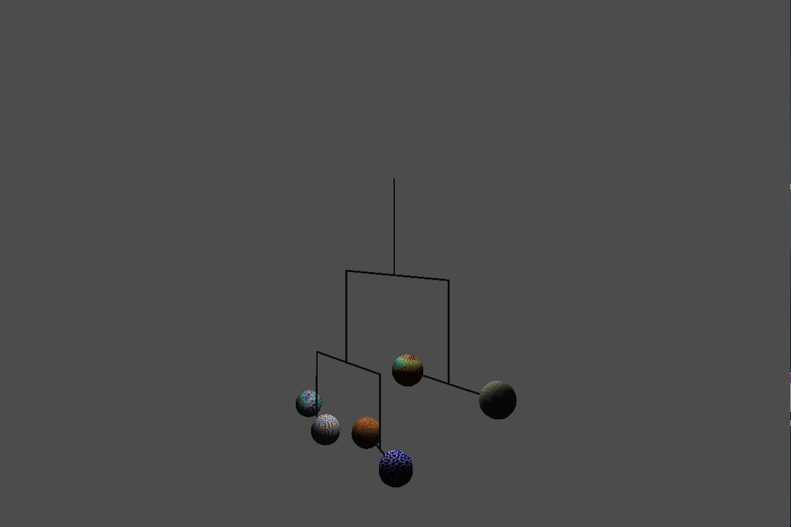
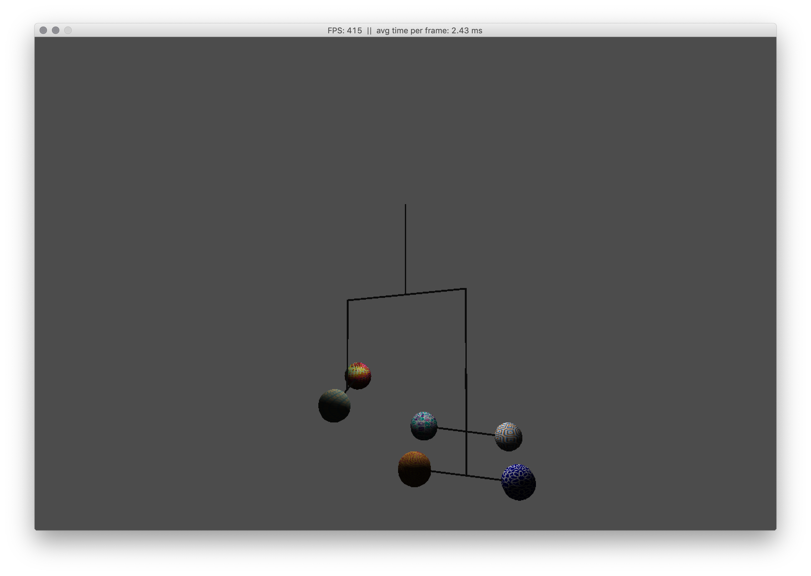

# openGL-Mobilee
Universtiy Project for a computer graphics class

  
  

It's a true to scale model of our solar system. WASD to move it around, mouse to change camera, spacebar to change to wireview.
